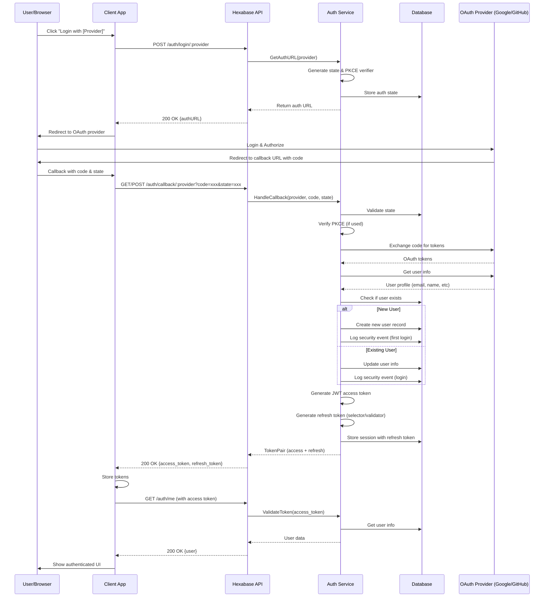
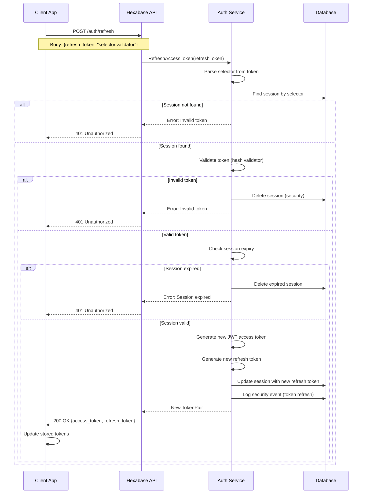
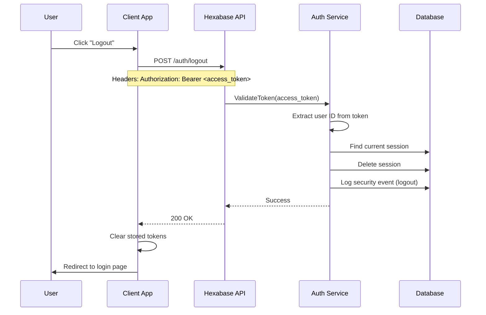
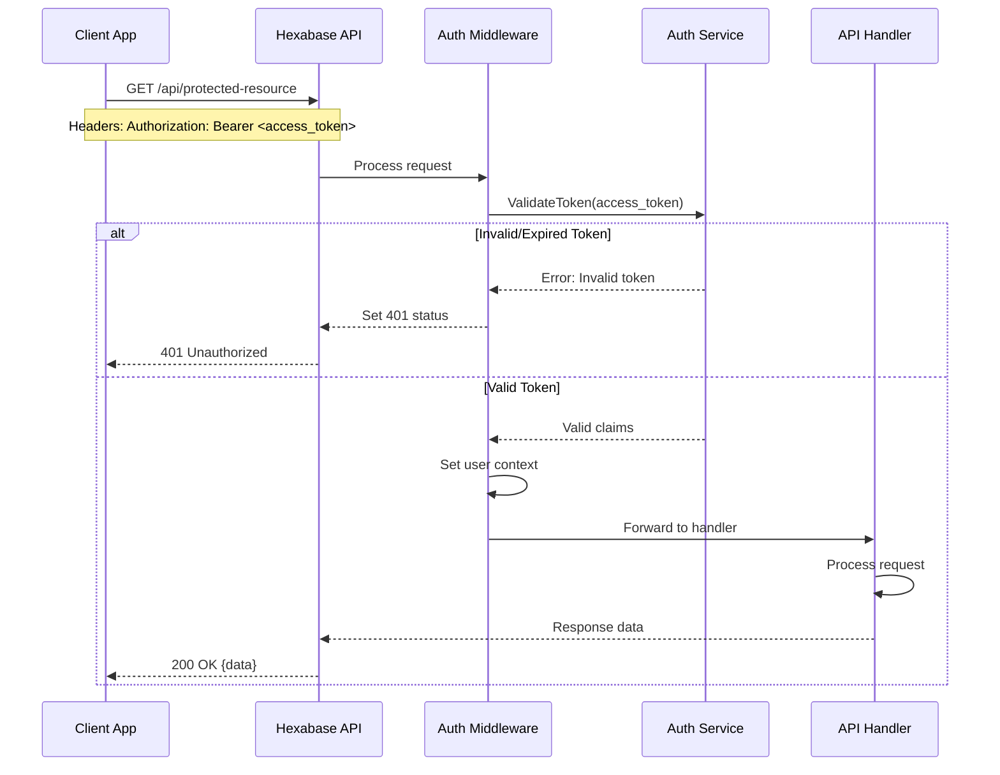

# Authentication Sequence Diagrams

## 1. OAuth Login/Registration Flow

This flow handles both new user registration and existing user login through OAuth providers.

## 2. Token Refresh Flow

This flow is used when the access token expires and needs to be refreshed.

## 3. Logout Flow

## 4. API Request with Authentication

## Key Security Features

1. **PKCE (Proof Key for Code Exchange)**: Prevents authorization code interception attacks
2. **State Parameter**: Prevents CSRF attacks in OAuth flow
3. **Selector/Validator Pattern**: Prevents timing attacks on refresh tokens
4. **Token Rotation**: New refresh token issued on each refresh
5. **Session Management**: Track all active sessions per user
6. **Security Event Logging**: Audit trail of all auth events

## Notes

- No traditional username/password signup - all users authenticate via OAuth providers
- New users are automatically created on first successful OAuth login
- User profile information is synced from OAuth provider
- Access tokens are short-lived JWTs (configurable, typically 15-30 minutes)
- Refresh tokens are long-lived (configurable, typically 7-30 days)
- All tokens are invalidated on logout